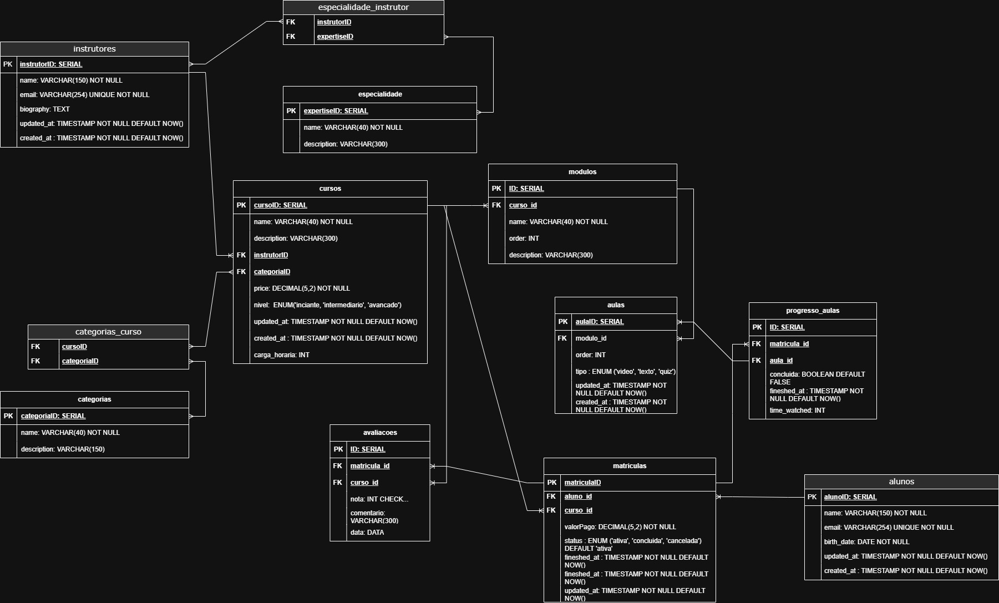

# Documentação Edutech

## Sumário
1. [Descrição do Projeto](#descrição-do-projeto)
2. [Diagrama ER](#diagrama-er)
3. [Estrutura do Banco](#estrutura-do-banco)
4. [Scripts Python](#scripts-python)
5. [Como Executar](#como-executar)

## Descrição do Projeto
Edutech é uma plataforma focada no ensino e capacitação dos profissionais no mercado de trabalho.

## Diagrama ER

## Estrutura do Banco
### Tabelas
#### Alunos
Dados dos alunos como (id, nome, email, data_aniversario, updated e created at)
#### Instrutores
Dados dos instrutores (id, nome, email, biografia, updated e created at)
#### Especialidades
Dados das especialidades (id, nome, descricao)
#### Especialidades_instrutor
Relacionamento entre o instrutor e as especialidades, relação many to many (id, fk_instrutor, fk_especialidade)
#### Cursos
Dados dos cursos (id, nome, descricao, nivel, preco, carga_horaria, fk_instrutor, updated e created at)
#### Categorias_curso
Relacionamento entre cursos e categorias, relação many to many (id, fk_curso, fk_categoria)
#### Modulos
Dados dos módulos de cada curso (id, fk_curso, nome, ordem, descricao)
#### Aulas
Dados das aulas de cada módulo (id, ordem, tipo, fk_modulo, updated e created at)
#### Matriculas
Dados das matriculas dos alunos em cursos (id, fk_alunos, fk_curso,valor_pago, status, updated, created e finished_at)
#### Avaliacoes
Dados das avaliações dos cursos (id, fk_matricula, fk_curso, nota, comentario, data_avl)
#### Progresso_aulas
Relacionamento entre matriculas e aulas, indicando progresso (id, fk_matricula, fk_aula, concluida, finished_at, time_watched)

## Python
### Scripts geração de dados:
Os dados são gerados por meio de loops utilizando a biblioteca `faker` e dados mockados (para trazer mais realismo). Esses dados são armazenados no arquivo `dados.sql`, que posteriormente é executado no banco de dados.

### menu.py
É basicamente o **cérebro do projeto**. Nele, há um menu de opções (switch case) que permite:
- Inicializar ou reinicializar o banco de dados (v0.1)
- Inserir dados (v0.2)
- Executar queries pré-definidas(v0.1/0.2)
- Encerrar o programa (v0.1)

Obs: Algumas das funcionalidades ainda viram nas próximas atualizações (v0.2)

## Como Executar
1. **Criar a virtualenv e instalar as dependências**
```bash
make venv
```
2. **Criar .env com informações de conexão**
```bash
vim python/.env

#exemplo de config
DB_USER=nome_do_usuario_postgresql
DB_PASSWORD=senha_do_usuario_postgresql
```
3. **Executar o menu principal**
```bash
make
```
